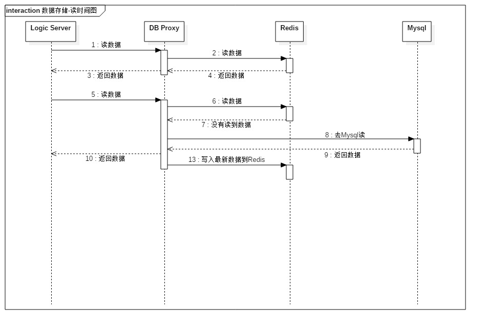
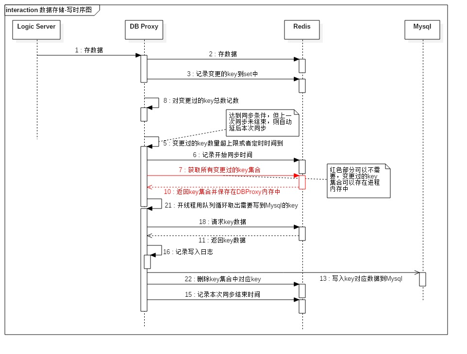

公司开了个新项目，不打算用原来的服务器框架，需要重新设计一下服务器框架来支持单服承载更多的人。此篇是记录数据库部分设计的想法。内力有限，如果有看官有建议，留言板还没弄，可以发我邮箱交流，谢谢！
[send mail](mailto:xcjmine@gmail.com)

数据库目前想用Redis做缓存，Mysql做固化存储。主要是时间紧，又要支持大量玩家，不想因为数据库可能存在的瓶颈而花时间重构。我们希望数据库是可以平行扩展的。如果说压力测试下来性能不满意，需要用主从、分布式多实例等方案时，代码上的改动不会过多。需要全部推翻重做是完全不能接受的。

跟大多数游戏服务端一样，我们会有一个DB Proxy进程做为代理，逻辑进程(Logic Server)通过DB Proxy和数据库通信。他们之间通过gRPC通信。这样的Proxy进程会有一个问题，就是和逻辑的耦合太强。它需要知道逻辑传递过来的数据结构，也要知道数据库那边的存储结构。需要进行转换、序列化等工作。而且这个例子中有2种数据库。所以我想到的是要么通过某种Shema文件自动生成代码，或者就是用反射，再或者就是Shema和反射结合。因为用了gRPC和protobuf。所以肯定是用.proto文件做Shema了。

通信方式和协议确定了之后，还要考虑一下Logic Server通过DB Proxy读写数据的数据流。在任何进程(包括Redis和Mysql)都有可能宕机的情况下，需要保证尽量不丢失数据。或者说尽量少丢失数据。其实在严格意义上来说，完全不丢失数据好像是不大可能的，所以说人家的高可用服务器也只能保证99.999%。:)

我画了2张时序图。

读数据相对来说比较简单，大部分网站的缓存也是这么做的，不多说。下面是写：

写数据主要的点在于什么时候写，如果说是逻辑进程一有数据到来就写Mysql，其实并没有减少写数据库的压力。因为写数据可能是对Mysql里的同一条数据进行多次修改。虽然有缓存在，用队列循环修改Mysql就算执行的很慢并不会影响逻辑进程取到最新的数据，但是写请求太多时容易堆积sql。如果这时候溢出甚至宕机，丢失的数据量可能会没办法估计。就算有写请求到来时先记录在日志文件中，你可能还是不知道宕机的时候队列中有多少数据，不知道执行到哪一条。除非写成功的语句再记录另一份日志到文件中。

所以我选择了现在的方案，可以合并多条对同一Record进程操作的sql语句。因为修改过的key也会存在Redis中，所以就算DB Proxy宕机了，起来之后也可以读取这些key，将数据重新塞到Mysql中。当然这种方案肯定还有别的坑，以后再来补充，暂时就先写这么多。

